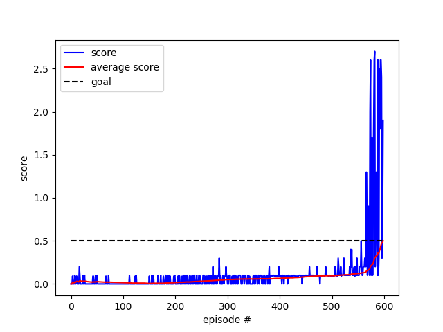

# Multi-agent reinforcement learning

The multi-agent deep deterministic policy gradient (MADDPG) algorithm is used to solve Udacity's *tennis* environment. Below the description of the environment from [Udacity's github](https://github.com/udacity/deep-reinforcement-learning/tree/master/p3_collab-compet).

## Environment

In this environment, two agents control rackets to bounce a ball over a net. If an agent hits the ball over the net, it receives a reward of +0.1.  If an agent lets a ball hit the ground or hits the ball out of bounds, it receives a reward of -0.01.  Thus, the goal of each agent is to keep the ball in play.

The observation space consists of 8 variables corresponding to the position and velocity of the ball and racket. Each agent receives its own, local observation.  Two continuous actions are available, corresponding to movement toward (or away from) the net, and jumping. 

The task is episodic, and in order to solve the environment, your agents must get an average score of +0.5 (over 100 consecutive episodes, after taking the maximum over both agents). Specifically,

- After each episode, we add up the rewards that each agent received (without discounting), to get a score for each agent. This yields 2 (potentially different) scores. We then take the maximum of these 2 scores.
- This yields a single **score** for each episode.

The environment is considered solved, when the average (over 100 episodes) of those **scores** is at least +0.5.

## Installing the environment

- Download the environment:
  - Linux: [click here](https://s3-us-west-1.amazonaws.com/udacity-drlnd/P3/Tennis/Tennis_Linux.zip)
  - Mac OSX: [click here](https://s3-us-west-1.amazonaws.com/udacity-drlnd/P3/Tennis/Tennis.app.zip)
  - Windows (32-bit): [click here](https://s3-us-west-1.amazonaws.com/udacity-drlnd/P3/Tennis/Tennis_Windows_x86.zip)
  - Windows (64-bit): [click here](https://s3-us-west-1.amazonaws.com/udacity-drlnd/P3/Tennis/Tennis_Windows_x86_64.zip)
- Place the file in the DRLND GitHub repository, in the `p3_collab-compet/` folder, and unzip (or decompress) the file.
- In the code, import the UnityEnvironment as follow (the file_name should target the reader's own *Reacher.exe*):

    ```python
    from unityagents import UnityEnvironment
    env = UnityEnvironment(file_name="C:\\Users\AL\Documents\GitHub\deep-reinforcement-learning\p3_collab-compet\Tennis_Windows_x86_64\Tennis.exe", no_graphics=True)


    ```

## Instructions

Run the `MADDPG.py` file to train the agents. During training, the code outputs the episode number, the average score over 100 episodes, the standard deviation of the normal noise and the max score from the deque (i.e. the last 100 episodes). After the maximum number of episodes (default is 1000) or if the environment is solved, the code saves the scores in `scores.txt` and saves the neural network weights in `Q0.pth`, `Q1.pth`, `mu0.pth` and `mu1.pth`.

- `network.py` contains the neural network achitectures.
- `agent.py` contains a class describing DDPG agents with centralized training and decentralized execution.
- `utils.py` contains the replay buffer class to store and sample transitions.
  
The agents should be able to solve the environment in approximatively 600-900 episodes (high variance and some instability are expected).

```dos
50/1000         average: 0.0265 sigma: 1.30      max: 0.20
100/1000        average: 0.0154 sigma: 1.14      max: 0.20
150/1000        average: 0.0057 sigma: 1.00      max: 0.10
200/1000        average: 0.0164 sigma: 0.87      max: 0.10
250/1000        average: 0.0309 sigma: 0.76      max: 0.10
300/1000        average: 0.0506 sigma: 0.66      max: 0.30
350/1000        average: 0.0574 sigma: 0.58      max: 0.30
400/1000        average: 0.0641 sigma: 0.51      max: 0.20
450/1000        average: 0.0824 sigma: 0.44      max: 0.20
500/1000        average: 0.0933 sigma: 0.39      max: 0.20
550/1000        average: 0.1210 sigma: 0.34      max: 0.40
598/1000        average: 0.5000 sigma: 0.30
solved in 598 episodes.
```


